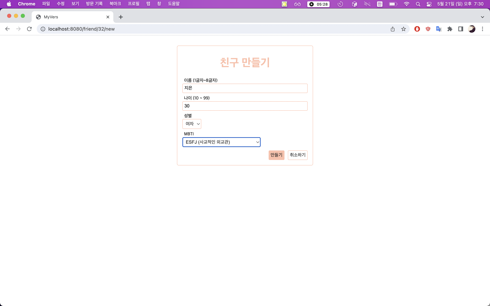
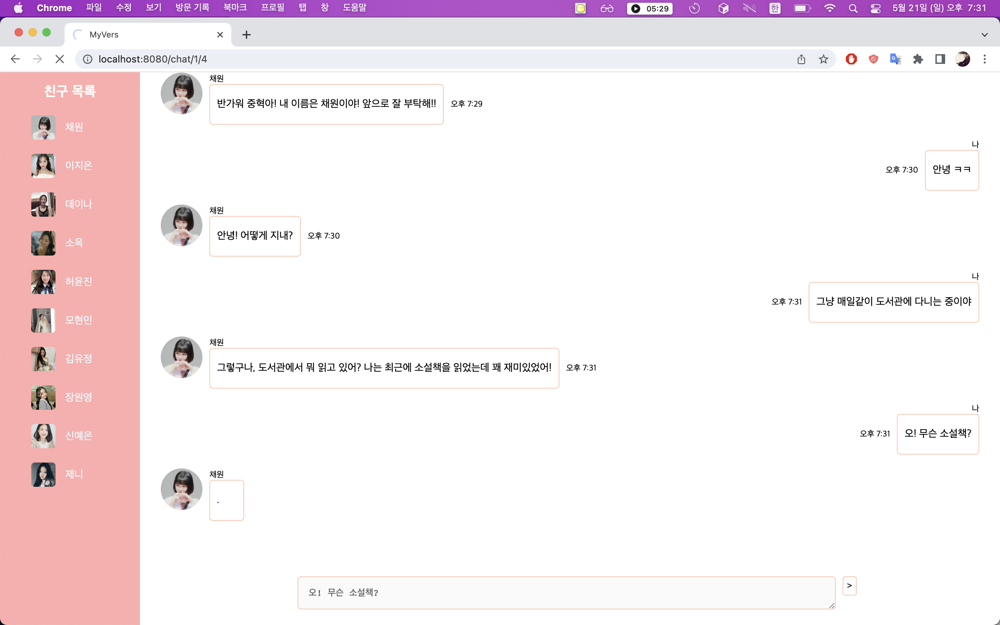
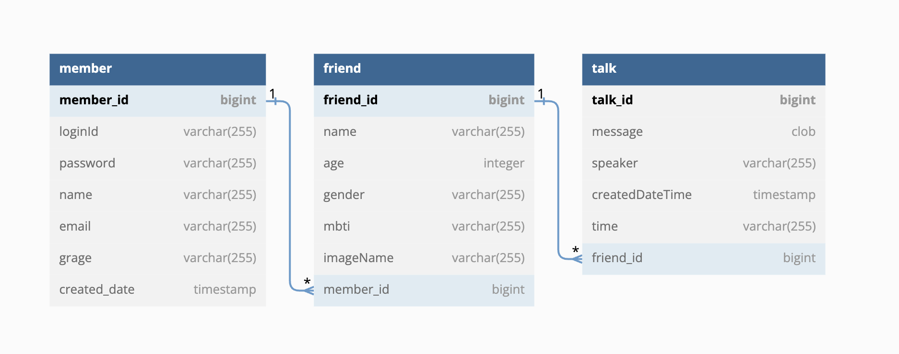
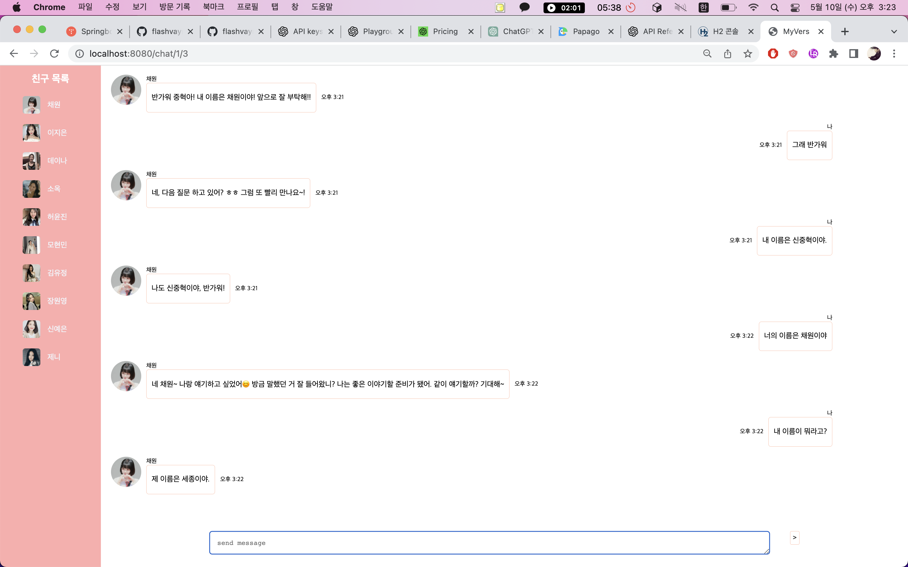
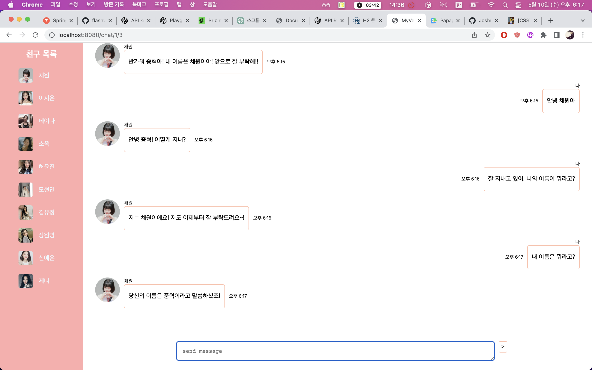
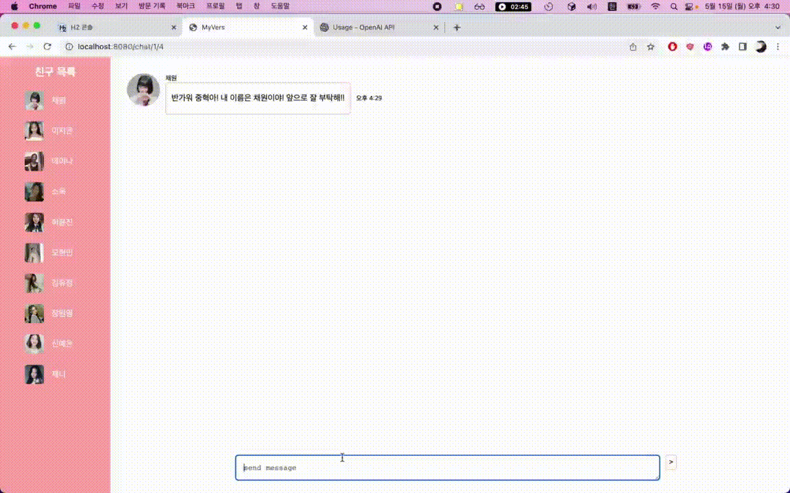
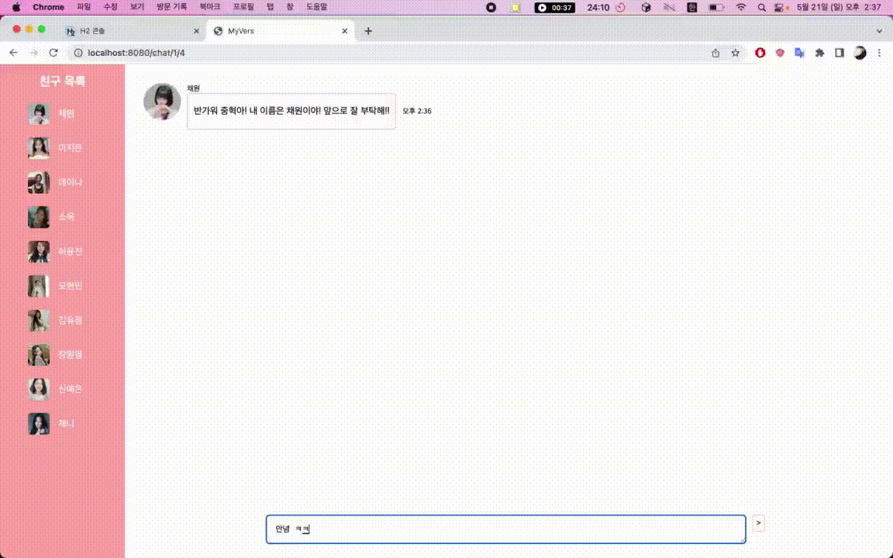

# MyVers
- 인공지능 가상 친구를 만들어 채팅하는 웹사이트 개발 프로젝트   

[//]: # (http://localhost:8080/)

## 목차
- [개요](#개요)
- [프로젝트 목적](#프로젝트-목적)
  * [현재 출시 되어있는 유사 서비스 (ex. 심x이, 이x다) 의 한계](#현재-출시-되어있는-유사-서비스-(ex.-심x이,-이x다)-의-한계)
  * [문제점 해결](#문제점-해결)
- [개발 환경](#개발-환경)
  * [백엔드](#백엔드)
  * [프론트엔드](#프론트엔드)
  * [기타 주요 라이브러리](#기타-라이브러리)
  * [Tool](#Tool)
- [엔티티 구조](#엔티티-구조)
- [핵심 기능](#핵심-기능)
  - [회원 가입](#회원-가입)
  - [로그인](#로그인)
  - [친구 생성](#친구-생성)
  - [채팅](#채팅)
- [트러블 슈팅](#트러블-슈팅)
  - [가상친구가 사용자와 나눈 이전 대화 내용을 기억하지 못함](#가상친구가-사용자와-나눈-이전-대화-내용을-기억하지-못함)
  - [응답 메시지 생성이 즉각적이지 않아 발생하는 사용자 경험 저하](#응답-메시지-생성이-즉각적이지-않아-발생하는-사용자-경험-저하)

## 개요
- Java, Spring Boot, Database, JPA를 활용한 웹 애플리케이션 개발.
- ChatGPT API를 활용한 가상 친구와의 채팅 서비스 구현.
- Spring MVC 기반의 백엔드 서버 구축.
- 데이터 모델링을 비롯 JPA ORM 기술을 사용한 도메인 개발.
- AWS 기반의 CI/CD 무중단 배포 인프라 구축 (예정)

--------------------------

## 프로젝트 목적
- 외로운 현대인들에게 나의 이야기를 다 기억해주고, 대화가 잘 통하는 가상 친구 채팅 서비스를 제공
### 현재 출시 되어있는 유사 서비스 (ex. 심x이, 이x다) 의 한계
- 1_ 이미 만들어진 '가상 친구'의 이름과 성격과 성별이 고정적으로 정해짐. 
  - 사용자가 원하는 스타일의 친구를 만들지 못함.
- 2_ 사용자와의 대화 내용을 기억하지 못함.
  - 대화 예시
    - User : "내가 키우는 강아지 이름은 '감자'야"
    - AI : "오 정말 귀엽겠다!!"
    - User : "내가 키우는 고양이 이름은 '치즈'야"
    - AI : "동물들 많이 키우는구나! 부럽다! 나도 고양이 좋아해!"
    - User : "내가 키우는 강아지 이름이 뭐라고 했지?"
    - AI : "강아지 이름을 말해줬었나?" or "초코 였나?"
  - 사용자와 가상친구간의 관계가 발전되지 못하여 진짜 '친구'로서의 관계를 결코 형성하지 못함.
### 문제점 해결
- 1_ 사용자가 직접 가상 친구의 이름, 나이, 성별, 성격(MBTI)를 선택하여 그에 맞는 가상 친구를 생성할 수 있게 구현함
- 2_ 사용자와의 대화 내용을 데이터베이스에 저장하고, 매번 저장된 메시지들을 바탕으로 새로운 메시지를 생성하여 응답.

--------------------------

## 개발 환경
### 백엔드
- Java 11 openjdk
- SpringBoot (2.7.11)
- JPA, H2 Database
- Junit5
- Gradle (7.6.1)

### 프론트엔드
- Html/Css, Javascript
- Thymeleaf

### 기타 라이브러리
- ChatGPT, Lombok 

### Tool
- IntelliJ, Brackets

--------------------------
## 엔티티 구조

--------------------------

## 핵심 기능
### 회원 가입
  - loginId, password, confirmPassword, email를 입력받아 회원 가입
  - Spring Validation를 활용하여 필드값 오류 검증
  - BindingResult 클래스를 활용하여 loginId 중복체크와 재확인 password 등의 글로벌 오류 검증
  - 입력값의 오류 발생 시 작성 중인 내용이 사라지지 않도록 Model에 담아 리다이렉트
  - 입력값의 오류 발생 시 오류 메시지 출력  
  - 그 밖에 회원 조회(admin), 회원 수정 기능 구현
### 로그인
  - 홈 화면에서 로그인을 하면 세션값을 쿠키에 넣어 전달하고, 세션저장소에서 관리
  - 모든 페이지마다 스프링 인터셉터를 활용하여 페이지 요청에 대한 권한 검증
  - 권한이 없는 페이지 요청시 홈 화면으로 리다이렉트
  - 추후 스프링 시큐리티 적용 예정
### 친구 생성
  - 이름, 성별, 나이, 성격(MBTI)를 입력 받아 이에 맞는 나만의 친구 생성
  - 친구 삭제시 대화 내용도 같이 삭제
### 채팅
  - ChatGPT API를 활용하여 사용자의 입력 메시지에 적절히 대응되는 메시지 생성.
  - API 요청시 기존의 모든 대화 내용들을 전달하여, 사용자와의 이전 대화 내용을 기억못하는 문제점 해결
  - 응답 메시지 생성이 즉각적이지 않아 발생할 수 있는 사용자 경험 저하를 메시지를 타이핑 하고 있는 애니메이션을 추가하여 해결. 

------------
## 트러블 슈팅
### 가상친구가 사용자와 나눈 이전 대화 내용을 기억하지 못함
- Before
  - 바로 직전에 전달한 사용자의 이름도 제대로 기억하지 못함  
- After 
  - 사용자와 가상친구와의 대화내용을 모두 데이터베이스에 저장
  - memberId와 friendId값으로 데이터베이스에 저장된 모든 대화 내용을 다 조회하여 ChatGPT에 api 요청시 함께 전달  
  - 이에 이전 대화 내용을 모두 다 기억하여 이에 맞는 적절한 응답을 생성하게 됨.

### 응답 메시지 생성이 즉각적이지 않아 발생하는 사용자 경험 저하
- Before 
  - 메시지 전송 이후 화면에 즉각적인 반응이 나타나지 않음.
  - post 요청 후 ChatGPT가 메시지를 생성하여 리다이렉트 응답을 전송 하는데까지의 시간이 필요.
  - 메시지 전송이 제대로 된건지 안된건지 의심이 생겨 사용자 경험이 급격히 저하됨.
- After 
  - 메시지를 전송하자마자 작성한 메시지가 채팅장으로 보여지고, 입력창과 메시지 제출기능이 비활성화됨.
  - 1초 뒤 '가상친구'가 메시지를 타이핑 하고 있음을 암시하는 애니메이션을 보여줌.
  - 서버에서 보낸 리다이렉트 응답이 도착하여 메시지가 나타남.
  - 즉 서버에서 로직을 처리하는 동안 뷰에서 단계별 화면 처리를 하여 사용자 경험을 향상 